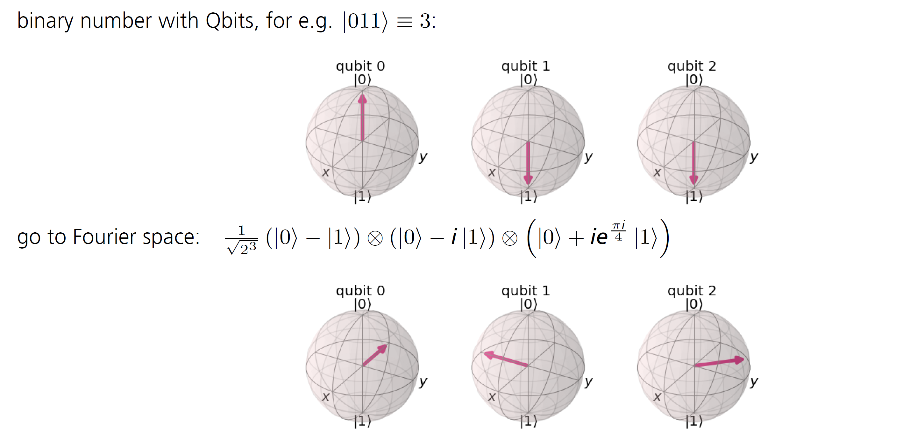

# More Qrisp Programming 

After we got you all hot and bothered in the last chapter (TODO: add link) about programming with qrisp, we are dedicating this section to the basics of quantum algorithms. We start with the Quantum Fourier Transformation, which is also a substep in the next algorithm, the Quantum Phase Estimation. These routines are crutial steps in many advanced algorithms, and therefore it's essential to get them down. 

## Quantum Fourier Transformation 

If I show you a function, can you tell me its frequency? This question might sound easy for simple functions like sine or cosine, but can get very tricky for irregular functions. This problem is part of the day-to-day-work in audio encoding and has a classical solution, which needs exponentional time and bits. (Although today, there exist more efficient versions on classical hardware, see Fast Fourier Transformations.)  
Perhaps, you have heard of Fourier Transformation in a math or physics lecture before. They are used to switch between different domains, like position and momentum in quantum mechanics or time and frequency in auditory processing. There, mostly the formulation for continuous functions is used: 
$$ f(x) = \frac{1}{\sqrt{2 \pi}} \int_{ - \infty}^\infty F(k) e^{ikx} dk$$

However, computers can't handle continuous functions, so we are looking at a discrete version instead.  
In addition, the quantum version offers an exponential speedup compared to the classical Fourier Transformation. In best cases, the QFT has a run time of $O(n~ log~ n)$ and use exponentally less gates. 

The main secret of the Quantum Fourier Transformation (QFT) is a change of basis. Let's illustrate that on a one qubit example: The computational basis of that is $\{\ket0, \ket1\}$. To change it into the Fourier basis, we need to apply a Hadamard gate to reach the new basis $\{\ket+, \ket-\}$.   
So what happens if we have more qubits? For n qubits, there are $2^n = N$ possible computational basis states. These are considered each on their own: 

$$\ket{\tilde j} = QFT \ket{j} = \frac{1}{\sqrt N}\sum^{N-1}_{k=0} e^{\frac{2 \pi i j k}{N}} \ket k$$

To make this equation clearer, we can also write it as a tensor product. For that, let's consider our input as a binary integer $j = j_n..j_3j_2j_1$ (each $j_n$ is either 0 or 1, all together encode a number). 
$$ \ket{\tilde{j}} = QFT \ket{j} = \frac{1}{\sqrt N} (\ket 0 + e^{\frac{2 \pi i j_1}{2} } \ket 1) \otimes (\ket 0 + e^{2 \pi i(\frac{j_2}{2}+ \frac{j_1}{4})}  \ket 1) \otimes (\ket 0 + e^{2 \pi i (\frac{j_3}{2}+ \frac{j_2}{4} + \frac{j_1}{8})}  \ket 1) \otimes ...$$

We can see the change of basis best on the Blochsphere: 



Here, we represent the number 3 in binary. 
The equation is $$ \ket{\tilde{3}} = QFT \ket{3} = \frac{1}{\sqrt 8} (\ket 0 + e^{\pi i } \ket 1) \otimes (\ket 0 + e^{2 \pi i(\frac{1}{2}+ \frac{1}{4})}  \ket 1) \otimes (\ket 0 + e^{2 \pi i (\frac{1}{4} + \frac{1}{8})}  \ket 1) $$

Now, for the implementation: We can see in the first factor $\ket 0 + e^{\frac{2 \pi i j_1}{2}}\ket 1$, that the qubit is brought into superposition, so we need a Hadamard Gate. The phase $e^{\frac{2 \pi i j_1}{2}}$ is automatically added, since the Hadamard gate transforms $\ket 1 \rightarrow \frac{\ket 0 + \ket 1}{\sqrt 2} $ when $j_1 = 0$
and $ \ket 0 \rightarrow \frac{\ket 0 - \ket 1}{\sqrt 2}$ when $j_1 = 1$ (because Euler's formular: $e^{\frac{2 \pi j_1}{2}} =e^{\pi i} = -1$). 
The next factor also is in superpostion, so again a Hadamard gate. Additionally, a phase of $e^{\frac{2 \pi i}{4}}$ is added, if $j_2=1$ . We implement that with a controlled phase gate, which can be simulated by a CNOT and a regular phase gate.
This process is repeated for every qubit. Now, we call multiple rotation gates of the form $ U_{Rot_k}\ket{x_j} =  e^{\frac{2 \pi i x_j }{2^k}} \ket{x_j}$. With every rotation, a phase is added to the state.

Of course, the Quantum Fourier Transformation is already implemented in Qrisp, so you only have to plug in the values in the function. 

```python
from qrisp import QuantumSession, QFT, QuantumVariable

qv = QuantumVariable(1)
print("QuantumVariable before QFT", qv)
QFT(qv)
print("QuantumVariable after QFT", qv)
print(qv.qs.statevector())
>>>{'0': 1.0}
>>>{'0': 0.5, '1': 0.5}
>>>sqrt(2)*(|0> + |1>)/2
```
Try naming a faster way! As we can see, for our one qubit example, the result is as predicted: We transformed from the $\{\ket0, \ket1\}$ basis where our qubit is $\ket 0$ to the $\{\ket+, \ket-\}$ basis where we get $\ket +$. You can also try this with the qubit starting in $\ket 1$ by applying an X-gate beforehand. 

We can also inspect the circuit without much extra work: 

```python 
from qrisp import QuantumSession, QFT, QuantumVariable, x, h

qv = QuantumVariable(1)
QFT(qv)
print(qv.qs)
```

```
QuantumCircuit:
---------------
        ┌─────┐
qv_0.0: ┤ QFT ├
        └─────┘
Live QuantumVariables:
----------------------
QuantumVariable qv_0
```
Okay, this might not be what you expected. This dense representation will be useful in more complicated algorithms later on, when you are already familiar with the QFT. For now, we can break it further down: 

```python 
from qrisp import QFT, QuantumVariable

qv = QuantumVariable(1)
QFT(qv)
print(qv.qs.transpile())
```

```
        ┌───┐
qv_0.0: ┤ H ├
        └───┘
```
As anticipated before, the QFT on one qubit only consists of the Hadamard gate. 

```python 
from qrisp import QFT, QuantumVariable

qv = QuantumVariable(4)
print("QuantumVariable before QFT", qv)
QFT(qv)
print("QuantumVariable after QFT", qv)
print(qv.qs.statevector())
print(qv.qs.transpile())
```

That's more like it! With 4 qubits involved, we can insepct the circuit deeper: 

```
{'0000': 1.0}
{'0000': 0.0625, '1000': 0.0625, '0100': 0.0625, '1100': 0.0625, '0010': 0.0625, '1010': 0.0625, '0110': 0.0625, '1110': 0.0625, '0001': 0.0625, '1001': 0.0625, '0101': 0.0625, '1101': 0.0625, '0011': 0.0625, '1011': 0.0625, '0111': 0.0625, '1111': 0.0625}
(|0000> + |0001> + |0010> + |0011> + |0100> + |0101> + |0110> + |0111> + |1000> + |1001> + |1010> + |1011> + |1100> + |1101> + |1110> + |1111>)/4
                                                            ┌───┐┌──────────┐»
qv_0.0: ────────────────────────────────────────────────────┤ X ├┤ P(-π/16) ├»
                                  ┌───┐┌─────────┐     ┌───┐└─┬─┘└──┬───┬───┘»
qv_0.1: ──────────────────────────┤ X ├┤ P(-π/8) ├─────┤ X ├──┼─────┤ X ├────»
             ┌───┐┌─────────┐┌───┐└─┬─┘└┬────────┤┌───┐└─┬─┘  │     └─┬─┘    »
qv_0.2: ─────┤ X ├┤ P(-π/4) ├┤ X ├──┼───┤ P(π/4) ├┤ H ├──┼────┼───────■──────»
        ┌───┐└─┬─┘└─────────┘└─┬─┘  │   └────────┘└───┘  │    │              »
qv_0.3: ┤ H ├──■───────────────■────■────────────────────■────■──────────────»
        └───┘                                                                »
«                   ┌───┐            ┌───┐┌─────────┐     ┌───┐   ┌───┐   »
«qv_0.0: ───────────┤ X ├────────────┤ X ├┤ P(-π/8) ├─────┤ X ├───┤ X ├───»
«        ┌─────────┐└─┬─┘   ┌───┐    └─┬─┘├─────────┤┌───┐└─┬─┘   └─┬─┘   »
«qv_0.1: ┤ P(-π/4) ├──┼─────┤ X ├──────┼──┤ P(3π/8) ├┤ H ├──┼───────■─────»
«        └─────────┘  │     └─┬─┘      │  └─────────┘└───┘  │  ┌─────────┐»
«qv_0.2: ─────────────┼───────■────────■────────────────────■──┤ P(3π/8) ├»
«                     │  ┌──────────┐                          └─────────┘»
«qv_0.3: ─────────────■──┤ P(7π/16) ├─────────────────────────────────────»
«                        └──────────┘                                     »
«        ┌─────────┐┌───┐┌──────────┐┌───┐┌───┐               ┌───┐
«qv_0.0: ┤ P(-π/4) ├┤ X ├┤ P(7π/16) ├┤ H ├┤ X ├───────■───────┤ X ├
«        └─────────┘└─┬─┘└┬────────┬┘├───┤└─┬─┘       │  ┌───┐└─┬─┘
«qv_0.1: ─────────────■───┤ P(π/4) ├─┤ X ├──┼────■────┼──┤ X ├──┼──
«                         └────────┘ └─┬─┘  │  ┌─┴─┐  │  └─┬─┘  │  
«qv_0.2: ──────────────────────────────■────┼──┤ X ├──┼────■────┼──
«                                           │  └───┘┌─┴─┐       │  
«qv_0.3: ───────────────────────────────────■───────┤ X ├───────■──
«                                                   └───┘          

```

The P-boxes are phase gates(TODO: add link to babys 1st qc) with their respective phase. 

Now, as all unitary operations, the QFT is reversible. That property comes in very handy: We present the **Inverse Quantum Fourier Transformation (IQFT)**. 

The IQFT is quite similar to the regular QFT, with the difference of the exponential: 

$$\ket{y} = QFT \ket{\tilde x} = \frac{1}{\sqrt N}\sum^{N-1}_{y=0} e^{-\frac{2 \pi i \tilde x y}{N}} \ket{\tilde x}$$

With minimal effort, we can also change our programming example: 

```python 
from qrisp import QuantumSession, QFT, QuantumVariable, x, h

qv = QuantumVariable(1)
h(qv)
print("QuantumVariable before IQFT", qv)
QFT(qv, inv=True)       # set inv=True for IQFT
print("QuantumVariable after IQFT", qv)
print(qv.qs.statevector())
>>>{'0': 0.5, '1': 0.5}
>>>{'0': 1.0}
>>>|0>
```
As you can see, this is the retransformation from Fourier basis to the computational basis $\{\ket 0, \ket 1\}$. The IQFT is also a part of our next algorithm, the Quantum Phase Estimation. 

## Quantum Phase Estimation 

As the name Quantum Phase Estimation (or QPE, for short) suggests, this algorithm deals with the phase of a complex number (TODO: add link to math). As you also should remember, any quantum operation can be expressed as a unitary operator and its eigenstates and eigenvalues. For the QPE, we consider the operator:
$$ U \ket{u} = e^{2\pi i \phi} \ket{u}$$

Where we already know the eigenvector $\ket u$. 
As a rule of quantum computing, all eigenvalues of unitary operators are of the form $e^{i\phi}$ (this is equivalent to $e^{2\pi i \phi}$ since $e^{2\pi}$ describes one full round on the unit circle).   
We also know that the absolute value of $e^{2\pi i \phi}$ hat to be equal to 1, so $0 <\phi <1$. The goal of QPE is to determine the phase $\phi$.

But why exactly is that supposed to be so complicated that we need a whole new algorithm? Let's revise some math concepts: 
In the earlier chapter (TODO:add link), we found that global phases are not detectable by measurement. For instance, the state
$$ \frac{1}{\sqrt 2} (\ket 0 + \ket 1)$$
has the the probabilities for measuring 0 and 1 as 
$$ e^{ i \pi}\frac{1}{\sqrt 2} (\ket 0 + \ket 1)$$
and we can only measure a relative phase such as $ \frac{1}{\sqrt 2}( \ket 0 + e^{i \pi} \ket 1) $.

However, QPE can turn that global phase into a relative phase and therefore it is detectable, making it a powerful tool in quantum computing.

Let's have a look at the implementation first and then work through the steps: 

```python 
from qrisp import p, QuantumVariable, QPE, multi_measurement, h
import numpy as np

def U(qv):
    x = 0.5             
    y = 0.125
    # this is what we want to calculate 

    p(x*2*np.pi, qv[0])
    p(y*2*np.pi, qv[1])

qv = QuantumVariable(2)

h(qv)

res = QPE(qv, U, precision = 3)
print(multi_measurement([qv, res]))
```
With the output looking like: 
```
{('00', 0.0): 0.25, ('10', 0.5): 0.25, ('01', 0.125): 0.25, ('11', 0.625): 0.25}
```
First, we define two phase gates with different phases. We then apply QPE with a single line and get the estimation of the previously defined phases (as fractions of $ 2\pi$). 

As always, we want to inspect the circuit: 

```
>>> print(qv.qs)
QuantumCircuit:
---------------
           ┌───┐                                                       »
   qv_0.0: ┤ H ├─■───────────────■───────────────■───────────────■─────»
           ├───┤ │               │               │               │     »
   qv_0.1: ┤ H ├─┼──────■────────┼──────■────────┼──────■────────┼─────»
           ├───┤ │P(π)  │P(π/4)  │      │        │      │        │     »
qpe_res.0: ┤ H ├─■──────■────────┼──────┼────────┼──────┼────────┼─────»
           ├───┤                 │P(π)  │P(π/4)  │P(π)  │P(π/4)  │     »
qpe_res.1: ┤ H ├─────────────────■──────■────────■──────■────────┼─────»
           ├───┤                                                 │P(π) »
qpe_res.2: ┤ H ├─────────────────────────────────────────────────■─────»
           └───┘                                                       »
«                                                                    »
«   qv_0.0: ──────────■───────────────■───────────────■──────────────»
«                     │               │               │              »
«   qv_0.1: ─■────────┼──────■────────┼──────■────────┼──────■───────»
«            │        │      │        │      │        │      │       »
«qpe_res.0: ─┼────────┼──────┼────────┼──────┼────────┼──────┼───────»
«            │        │      │        │      │        │      │       »
«qpe_res.1: ─┼────────┼──────┼────────┼──────┼────────┼──────┼───────»
«            │P(π/4)  │P(π)  │P(π/4)  │P(π)  │P(π/4)  │P(π)  │P(π/4) »
«qpe_res.2: ─■────────■──────■────────■──────■────────■──────■───────»
«                                                                    »
«                      
«   qv_0.0: ───────────
«                      
«   qv_0.1: ───────────
«           ┌─────────┐
«qpe_res.0: ┤0        ├
«           │         │
«qpe_res.1: ┤1 QFT_dg ├
«           │         │
«qpe_res.2: ┤2        ├
«           └─────────┘
Live QuantumVariables:
----------------------
QuantumVariable qv_0
QuantumFloat qpe_res
```  

Here, we have two registers, implemented as two QuantumVariables. The first one, qv_0,  is initialized in $\ket u$, the eigenvector. The second one, qpe_res, starts as $\ket 0^{\otimes j}$ (this just means all j qubits of the register are initalised in $\ket 0$) and is put into superposition with Hadamard gates. 

Controlled $U$ rotations are applied to qv_0 with qpe_res as control. These won't have an effect on qv_0, because it is in the eigenstate of $U$. 
Finally, IQFT is applied to the second register and it's measured. 

Wait, what? Why would we apply the $U$ rotation to qv_0, when it doesn't have an impact? This is the perfect time to revise phase kickback (TODO: add link), which changes the control register instead of the target qubit.  

Let's see a different example: If we apply a T-gate to a qubit in state $\ket 1$, we get $T \ket 1 = e^{\frac{i \pi}{4}} \ket 1$, which results in a global phase that is  not measureable by itself.  
However, if you apply a controlled T-gate with the control qubit in $\ket +$ and the target qubit in $\ket 1 $, you get $CT \ket{1+} =\frac{1}{\sqrt 2} CT (\ket{10} +  \ket{11} ) = \frac{1}{\sqrt 2} (\ket{10} + e^{i \pi /4} \ket{11} )= \ket 1 \otimes  \frac{1}{\sqrt 2} (\ket{0} + e^{i \pi /4} \ket{1})$, where the control qubit is changed to aquire the extra phase of $ e^{i \pi /4}$, which is now a relative phase. (Remember how I said QPE can turn a global phase into a relative phse and make it detectable?)
As you can see, we need superposition and controlled gates to create phase kickback, which are both ingredients to QPE.

Now, how can we interpret the output? 
In most frameworks, $\phi$ is written in binary representation, so $\phi = \frac{\phi_1}{2} + \frac{\phi_2}{4} + \frac{\phi_3}{8}...$. Lucky for you, Qrisp already does takes care of that for you and displays the result in decimal system. Our specific solution consists of 4 states: This can be seen as a superposition, since we designed two unitaries. The first option, ('00', 0.0): 0.25, states that no phase is applied. The next two solutions cover that one of the phases is applied, and the last option carries out both phases (('11', 0.625): 0.25). All four options are equally probable, as we can see. 

As the name quantum phase estimation also suggests, the result will be an estimate of $\phi$, and the precision depends on the number of qubits involved. In the Qrisp function, the precision is an argument. In this example, U is applied $2^{precision} -1 = 2^3 -1= 7 $ times. Therefore, res consists of precision = 3 qubits. For this example, that is enough, but if your phases have values with more decimal places, you might need a higher precision. 

Both of these routines will be frequent guests in the next chapters, when we dive into more complicated algorithms, like Shor's algorithm for factoring.  In the next chapter, we are going back to oracles and have a look at Grover's algorithm. Until then, stay qrispy! 